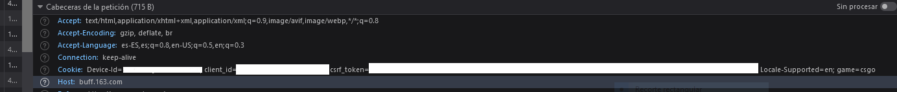
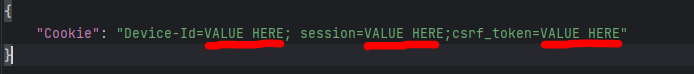

# BuffPrices

This program allows you to check the sell prices of CS:GO items and store the information in a CSV file.

## Features
- Check sell prices for specific items
- Check buy orders
- Currency converter (USD)
- Search with range of float
- Info about trade records in the page

## Requirements

Before using this program, make sure you have the following requirements:

1. Python: You will need to have [Python](https://www.python.org/) installed on your system.

## Installation

Follow these steps to install and set up the program:

1. Clone or download this repository to your local machine.

2. Navigate to the project folder:

3. Install the necessary dependencies using the following command: 
`pip install -r requirements.txt`

## Usage

To use the program, follow these steps:

1. Run the main.py file from the command line or using your favorite IDE.
2. You will be prompted to enter how many offers for one item you want to check.(1,2,3... For the cheapest offer, the two cheapest offers...)
3. You will be prompted to enter the names of the items you want to check. For example: "★ M9 Bayonet | Bright Water (Field-Tested)" when you have added all the items you want to search for, write 0 to make the search.
4. You can also specify the name of a file(**.txt**) in the application directory where you have multiple item names to read them all at once.
5. You can also add the currency in which you want the price of the items (currently only USD).
6. You can specify if you want info about buy orders for the specified items.
7. You can choose if you want the program to generate another file called **last_sales.csv**, with info about the sales for the specified items
8. The program will generate a CSV file at the "../prices.csv" path with the name of the items, their price, and other relevant attributes such as phase in Dopplers or fade percentage in Fades.

### Example
Screenshots for input and its corresponding response in the CSV file.:

---

## Setup Buff163 cookies

 Go to [buff163](https://buff.163.com), obtain your cookie values (necessary for certain functions, such as searching with a float range). Follow these steps (you need to log in first):

1. Press F12 to open the developer console
2. Go to the Network tab and refresh the webpage
3. Find session in the Set-Cookie field under Response Headers 
4. Copy the value of session and paste it into `config.json`(you need the value of **Device-Id**;**session**;**csrf_token**)
5. `config.json` should look like this if you want to search by min and max float 

---
Feel free to customize the content according to your needs and add any other relevant sections for your project!

## Credits

I would like to express my gratitude to [ModestSerhat](https://github.com/ModestSerhat) for providing the repository [buff163-ids](https://github.com/ModestSerhat/buff163-ids) which was instrumental in obtaining the IDs of CS:GO items for this project. Their work has greatly contributed to the functionality of this program.
